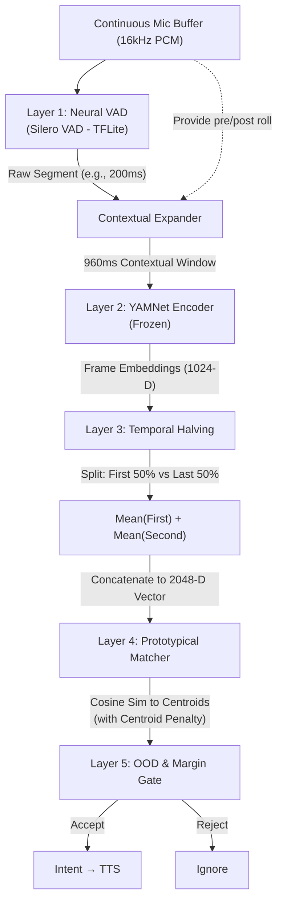

# Voxa Architecture v4: Rigorous Edge Prototypical Matching

## 1. Core Philosophy & Design Rationale

The original Voxa architecture relied on a classical DSP pipeline (MFCC + DTW). That approach is brittle and computationally expensive.

Because Voxa currently has **zero training data**, we use a **frozen, pretrained encoder** (YAMNet) and **Prototypical Matching**.

_Statistical Honesty:_ With 8–10 enrollment samples in a high-dimensional space, we cannot reliably estimate a multidimensional distribution. Therefore, we rely strictly on **Cosine Similarity to a centroid (point)**. Every architectural decision below is made with the understanding that we are operating in a low-data, sparse regime, and hardcoded magic numbers are strictly forbidden.

---

## 2. System Architecture Pipeline

---

## 3. Layer-by-Layer Implementation Details

### Layer 1: Neural Voice Activity Detection (VAD)

**Component:** Silero VAD (TFLite).

- Replaces static RMS energy thresholds. Allows variable segment lengths from **150ms to 6000ms**.

### Layer 2: Contextual Padding & Frozen Encoder

**Component:** YAMNet (TFLite, ~4MB).

- **The Fix:** YAMNet requires a 0.96s (960ms) window. The app maintains a 1.5s circular audio buffer. If VAD detects a short segment (e.g., 200ms), the system extracts the segment **plus** pre-roll and post-roll audio to fill 960ms. This prevents zero-padding from poisoning the embedding.

### Layer 3: Temporal Halving (Named Tradeoff)

**Component:** Kotlin-native vector math.

- **The Problem:** Mean-pooling across all frames destroys temporal dynamics (e.g., distinguishing a rising hum from a falling hum).
- **The Fix:** The sequence of frame embeddings is split in half. We compute `Mean(First_Half)` and `Mean(Second_Half)` and concatenate them to a **2048-D vector**.
- **EXPLICIT TRADEOFF ACKNOWLEDGMENT:** Doubling the dimensionality from 1024-D to 2048-D exacerbates the sparsity of our centroid estimates. We are explicitly trading _distributional reliability_ for _temporal resolution_. This is acceptable because failing to distinguish directional sounds is a worse failure mode than a noisier centroid. To mitigate the noise, we require a strict minimum of **10 valid samples** per intent to stabilize the 2048-D centroid.

### Layer 4: Personalized Prototypical Matching

**Component:** `PrototypicalMatcher`.

- Computes **Cosine Similarity** between the live 2048-D vector and all stored enrolled prototypes.
- **Centroid Count Penalty (CCP):** If an intent has been bifurcated into 2 centroids (see Enrollment), it gets two chances to achieve a high max similarity. To prevent unfairly disadvantaging single-centroid intents, we apply a penalty. The effective similarity for an intent is: `Effective_Sim = Max_Sim - ((k - 1) * CCP)`, where `k` is the number of centroids and `CCP` is a calibrated constant (e.g., 0.05).

### Layer 5: Out-of-Distribution (OOD) & Margin Gate

**Component:** `OODGate`.

- **OOD Rejector:** If max effective similarity to any intent is below a dynamically calibrated threshold, reject.
- **Margin Check:** Ensures the best intent's effective similarity is sufficiently higher than the second-best intent's effective similarity.

---

## 4. The Enrollment Flow (Few-Shot, No-Training)

### Step 1: Recording & Embedding

1. Caregiver records the child making the target vocalization **10 to 15 times**. (Minimum 10 required to stabilize 2048-D).
2. Each recording passes through VAD -> Contextual Padding -> YAMNet -> Temporal Halving to produce 2048-D vectors.

### Step 2: Strict Outlier Rejection (QC)

1. Compute an initial centroid (mean) of the vectors.
2. Calculate the cosine distance ($1 - \text{similarity}$) of each vector to this initial centroid.
3. Calculate the mean ($\mu$) and standard deviation ($\sigma$) of these distances.
4. **Rule:** Discard any vector whose distance $> \mu + 2\sigma$.
5. Recompute the final centroid(s) using only the valid remaining vectors.

### Step 3: Intra-Class Variance Handling (Calm vs. Dysregulated)

_Problem:_ A child's vocalization may change drastically based on emotional state. A single centroid might sit in a void.
_Solution:_ **Strict Bifurcation Rules.**

1. **Minimum Sample Count:** Bifurcation is **FORBIDDEN** if the post-QC valid sample count is less than **12**. If < 12, a single centroid is forced.
2. **Dynamic Variance Trigger:** If valid samples >= 12, calculate the max pairwise distance between the samples.
   - _No Magic Numbers:_ The trigger threshold is tied to the child's dynamically calibrated OOD ambient noise threshold.
   - If `max_pairwise_distance > (OOD_Threshold * 0.5)`, the samples are too far apart to represent a single state.
3. **Clustering:** If triggered, run K=2 K-Means. Store **2 separate centroids**.
4. **UI Warning:** The app displays: _"These recordings sound very different. For best results, try recording when [Child] is calm, or record the stressed version separately."_

### Step 4: Storage

The 2048-D centroid(s) are serialized as a `ByteArray` and stored in local SQLite (Room).

---

## 5. Testing & Validation Protocol

_You must test this using your own voice (as an imposter) and a child's voice (as the target)._

### Phase 1: Imposter & Distractor Testing (Your Voice)

**Goal:** Validate the OOD Gate and Centroid Count Penalty.

1. **Enrollment:** Enroll 3 intents with a child's voice (8-10 samples each). Enroll 1 intent with 12 samples to force bifurcation.
2. **Imposter Test (Your Voice):** You attempt to mimic the sounds 20 times each.
3. **Distractor Test:** Play 50 clips of random household noises.
4. **Metric:** Calculate the **False Accept Rate (FAR)**. Target: FAR < 5%.

### Phase 2: Intra-Speaker Variance Testing (Child's Voice)

**Goal:** Validate the Bifurcation logic and the 12-sample minimum.

1. **Calm Enrollment:** Enroll 3 intents with a child in the morning (10 samples).
2. **Stressed Test Set:** Record the child making the same sounds when frustrated (15 samples).
3. **Metric A (Single Centroid):** Measure accuracy on the stressed set using the morning model. (Expected to be poor).
4. **Metric B (Bifurcated):** Enroll 5 stressed samples (total 15). Verify the system triggers bifurcation. Re-measure accuracy on the remaining 10 stressed test samples.
   - **Target:** Bifurcated accuracy should be > 85%. Verify that the bifurcated intent does not unfairly trigger during Phase 1 distractor testing (validates the CCP penalty).

### Phase 3: Temporal Dynamics Testing (Directional Sounds)

**Goal:** Prove the 2048-D Temporal Halving justifies its dimensionality tradeoff.

1. **Enrollment:** Enroll two mirror-image intents: rising pitch (`ooo-eee`) and falling pitch (`eee-ooo`).
2. **Test:** Record 10 samples of each.
3. **Validation:** Check the confusion matrix.
   - **Target:** > 95% accuracy. If accuracy is ~50%, the dimensionality tradeoff failed and mean-pooling is destroying the signal.

### Phase 4: Latency Profiling

1. Run the full pipeline on a mid-range Android device.
2. Measure p50 and p95 inference time.
   - **Target:** p95 < 250ms.

---

## 6. Known Limitations

- **Dimensionality vs. Sparsity:** The 2048-D vector makes centroid estimates noisier. We mitigate this by requiring 10+ samples, but it remains a known statistical weakness traded for temporal resolution.
- **Statistical Limits of Bifurcation:** Even with a 12-sample minimum, K=2 K-Means is sensitive to initialization. We rely on the UI warning to ensure the caregiver is intentionally feeding two distinct acoustic states into the system, rather than random noise.
- **Future Phase:** When hundreds of hours of data are collected, train a 2-layer projection head on top of YAMNet using Prototypical Loss to pull idiosyncratic sounds closer together, reducing the reliance on raw sparse centroids.
